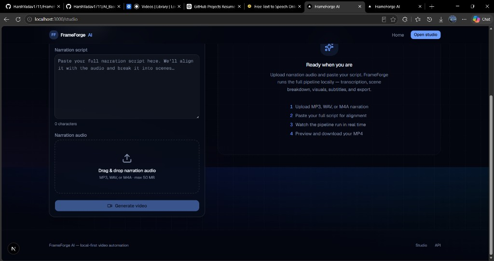
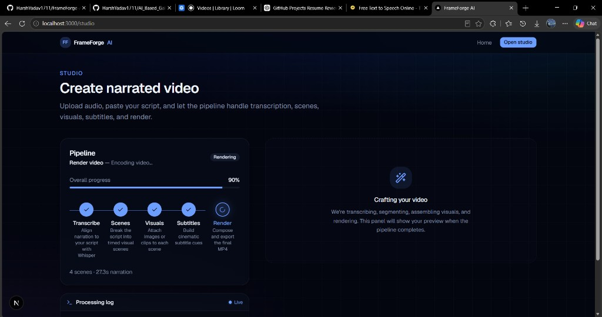
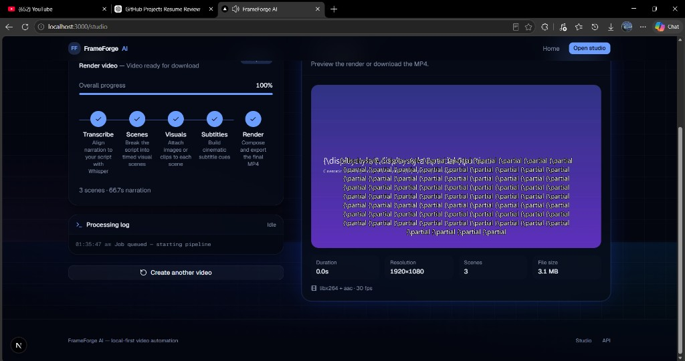
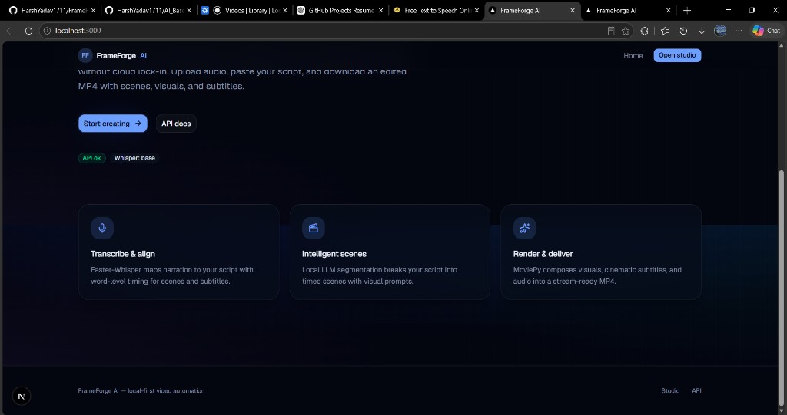
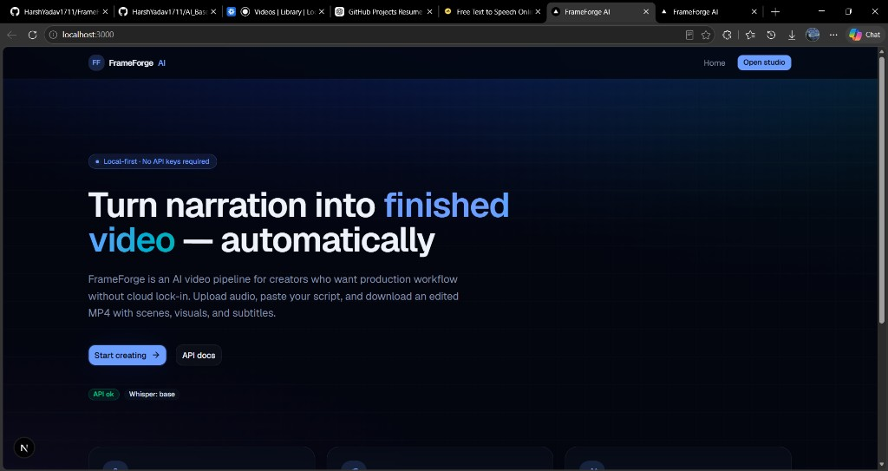
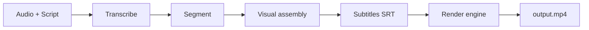

# FrameForge AI

**Local-first pipeline that turns narration audio + a script into a timed, subtitled MP4.**

FrameForge is a modular monolith: a FastAPI backend runs transcription, scene segmentation, visual assembly, subtitle generation, and FFmpeg-backed rendering; a Next.js studio submits jobs and tracks progress in real time. No database, no cloud API keys required for the default path—artifacts live on disk under `backend/storage/`.

---

## Overview

Creators and engineers use FrameForge when they want **repeatable video assembly** without handing raw narration to a black-box SaaS editor. You upload audio, paste the script the voice actor (or TTS) followed, and the system:

1. Transcribes audio with **Faster-Whisper** and aligns timing to the script.
2. Segments the script into **scenes** (Ollama LLM with heuristic/timeline fallbacks).
3. **Attaches visuals** per scene—generated placeholders or your own `scene_NNN.jpg` / `.mp4` files.
4. Builds **SRT** and optionally burns **cinematic subtitles** into the frame.
5. **Renders** a single H.264/AAC MP4 with configurable quality and streaming-friendly `faststart`.

The studio UI exposes a five-step progress stepper, a live processing log (fed from job metadata), and an output preview with export metadata when rendering completes.

---

## Screenshots

> Add captures under `docs/screenshots/` and replace the placeholders below.

| Studio — new project | Studio — pipeline running | Completed output |
|----------------------|---------------------------|------------------|
|  |  |  |
| *Upload form + script* | *Stepper + processing log* | *Video preview + metadata* |

| Landing | API health |
|---------|------------|
|  |  |

```text
docs/screenshots/
  studio-empty.png       # /studio before job submit
  studio-processing.png  # stepper + logs during render
  studio-complete.png    # output preview + download
  landing.png            # marketing hero
  health-badge.png       # optional — API status on landing
```

---

## Architecture

```text
┌─────────────────────────────────────────────────────────────────┐
│  Next.js 16 (App Router) — localhost:3000                       │
│  / · /studio · typed API client · job polling · progress UI      │
└────────────────────────────┬────────────────────────────────────┘
                             │ REST /api/v1
┌────────────────────────────▼────────────────────────────────────┐
│  FastAPI — localhost:8000                                         │
│  routes: health · uploads · jobs                                  │
│  PipelineOrchestrator (async steps via asyncio.to_thread)         │
└────────────────────────────┬────────────────────────────────────┘
                             │
     ┌───────────────────────┼───────────────────────┐
     ▼                       ▼                       ▼
 transcription          segmentation           visual_assembly
 (Faster-Whisper)       (Ollama / heuristic)   (validate · normalize · timeline)
     │                       │                       │
     └───────────────────────┼───────────────────────┘
                             ▼
                    subtitles · rendering
                    (SRT · MoviePy + FFmpeg)
                             │
                             ▼
              backend/storage/jobs/<uuid>/
              job.json · transcript.json · output.mp4 · …
```

### Repository layout

| Path | Responsibility |
|------|----------------|
| `frontend/src/app/` | Routes: landing (`/`), studio (`/studio`) |
| `frontend/src/components/studio/` | Upload form, stepper, logs, output preview |
| `frontend/src/lib/api/` | Jobs, uploads, health clients |
| `backend/app/api/routes/` | Thin HTTP layer |
| `backend/app/pipeline/orchestrator.py` | Ordered pipeline steps + error mapping |
| `backend/app/services/` | Domain modules (no HTTP imports) |
| `backend/app/models/schemas.py` | Shared Pydantic contracts |
| `backend/storage/` | Uploads + per-job artifact directories |

### Job storage (no DB)

Each job is a folder:

```text
storage/jobs/<job_id>/
  job.json                 # status, progress, scenes, metadata
  audio.*                  # narration upload
  transcript.json
  scenes.json
  visual_timeline.json
  visuals/                 # scene_001.jpg, scene_002.mp4, normalized/
  subtitles.srt
  render_output.json       # ffprobe-style export metadata
  render_state.json        # lifecycle during encode (cleared on success)
  output.mp4
```

`JobStore` reads/writes `job.json`. This keeps local development simple and makes jobs inspectable with ordinary tools. Multi-instance deployment would need shared storage or a persistence swap—see [Roadmap](#roadmap).

---

## Pipeline

The orchestrator runs five **pipeline steps** (surfaced in the UI and API as `progress.step`):

| Step | Service | What happens |
|------|---------|----------------|
| **transcribe** | `services/transcription` | Faster-Whisper → segments, `transcript.json`, timeline blocks |
| **segment** | `services/segmentation` | Script + transcript → `Scene` list with `start_time` / `end_time` |
| **visuals** | `services/visual_assembly` | Per-scene media: validate → preprocess → normalize → `visual_timeline.json` |
| **subtitles** | `services/subtitles` | SRT from segments; burn-in optional at render |
| **render** | `services/rendering` | Compose clips + audio → encode MP4 |



### Visual assembly

- **Default:** gradient placeholder images from `visual_prompt` (Pillow, no external image API).
- **Override:** place `scene_001.png`, `scene_002.mp4`, etc. in the job `visuals/` directory before the visuals step (or pre-stage in a future upload flow).
- Images are cover-cropped to `VIDEO_WIDTH` × `VIDEO_HEIGHT`; videos are probed and trimmed at render time.
- Transitions: `cut`, `fade`, `crossfade` (configurable per job defaults).

### Rendering engine

`VideoRenderEngine` (`services/rendering/`):

1. **Compose** — `build_clips_from_timeline` + subtitle overlays + narration via MoviePy.
2. **Encode** — `write_videofile` (libx264, AAC, CRF, preset) to `output.mp4.partial`.
3. **Finalize** — optional FFmpeg remux for `+faststart`; atomic promote to `output.mp4`.
4. **Recover** — configurable retries with temp/partial cleanup between attempts.
5. **Queue** — `RenderQueue` serializes encodes so concurrent jobs do not fight for CPU.

Progress is written to `job.metadata.rendering_progress` and mapped to studio percent (85–99) during the render step.

---

## Features

### Core

- Script + audio → single MP4 with scene timing
- Faster-Whisper transcription with optional script initial prompt
- Segmentation via Ollama (`auto` backend) with heuristic/timeline fallbacks
- Visual timeline JSON artifact for debugging and re-render
- Cinematic subtitle themes (ratio-based typography, fade animation)
- Studio: stepper, live log panel, output preview, download

### API & ops

- OpenAPI at `/docs`
- Liveness / readiness health checks
- Structured errors (`FrameForgeError` codes)
- CORS for local Next.js

### Developer experience

- Typed frontend clients
- Ruff (backend) + ESLint/Prettier/tsc (frontend)
- Unit tests for visual assembly and rendering helpers

---

## Technical decisions

| Decision | Rationale |
|----------|-----------|
| **Modular monolith** | One deployable unit; clear module boundaries without network chatter between pipeline stages. |
| **File-backed jobs** | Zero ops for SQLite/Postgres in v0; easy to inspect and delete; tradeoff is horizontal scale. |
| **Blocking ML in thread pool** | Whisper, MoviePy, and Pillow block; `asyncio.to_thread` keeps the event loop responsive for status polling. |
| **Single render queue** | Encodes are CPU-heavy; serial queue avoids thrashing on laptops and small VMs. |
| **Partial then promote** | Failed encodes do not corrupt `output.mp4`; retries start clean. |
| **MoviePy v1/v2 compat** | `moviepy_compat` isolates import differences for clips and effects. |
| **Optional Ollama / Gemini** | Segmentation quality improves with LLM; heuristics keep the pipeline alive offline. |
| **No auth in v0** | Local tool first; auth and tenancy belong behind explicit product requirements. |

---

## Project philosophy

1. **Inspectable over opaque** — JSON artifacts and folders beat opaque project blobs.
2. **Boring infrastructure** — FastAPI, Next.js, FFmpeg; avoid custom job systems until needed.
3. **Fail with context** — `TranscriptionError`, `SegmentationError`, `VisualAssemblyError`, `RenderingError` carry step and cause for the UI and logs.
4. **Small modules, flat abstractions** — `visual_assembly/` and `rendering/` packages are focused; no enterprise framework inside the repo.
5. **Local-first default** — Cloud APIs are optional flags, not prerequisites.

---

## Setup

### Prerequisites

- **Python 3.11+**
- **Node.js 20+**
- **FFmpeg** on `PATH` (required for MoviePy export and faststart remux)
- **Ollama** (optional, recommended for segmentation): `ollama pull llama3.2`

### Backend

```bash
cd backend
python -m venv .venv

# Windows
.venv\Scripts\activate
# macOS/Linux
# source .venv/bin/activate

pip install -r requirements.txt
copy .env.example .env   # Windows — use cp on Unix
python run.py
```

API: [http://localhost:8000](http://localhost:8000) · OpenAPI: [http://localhost:8000/docs](http://localhost:8000/docs)

### Frontend

```bash
cd frontend
npm install
```

Create `frontend/.env.local`:

```env
NEXT_PUBLIC_API_URL=http://localhost:8000
```

```bash
npm run dev
```

Studio: [http://localhost:3000/studio](http://localhost:3000/studio)

### Verify

```bash
curl http://localhost:8000/api/v1/health
curl http://localhost:8000/api/v1/health/ready
```

### Custom scene media (optional)

After a job is created, before or during the visuals step, add files to:

```text
backend/storage/jobs/<job_id>/visuals/scene_001.jpg
backend/storage/jobs/<job_id>/visuals/scene_002.mp4
```

Supported images: `.jpg`, `.jpeg`, `.png`, `.webp`, `.bmp`  
Supported video: `.mp4`, `.mov`, `.webm`, `.mkv`, `.avi`

---

## API overview

Base path: `/api/v1`

### Health

| Method | Path | Description |
|--------|------|-------------|
| `GET` | `/health` | Version, Whisper model, Ollama/Gemini flags |
| `GET` | `/health/live` | Process liveness |
| `GET` | `/health/ready` | Storage writable |

### Uploads

| Method | Path | Description |
|--------|------|-------------|
| `POST` | `/uploads` | Upload narration audio → `upload_id` |
| `GET` | `/uploads/{upload_id}` | Upload metadata |

### Jobs

| Method | Path | Description |
|--------|------|-------------|
| `POST` | `/jobs` | Start pipeline (`script` + `upload_id` or `audio` file) → `202` |
| `GET` | `/jobs/{job_id}` | Status, progress, metadata (incl. rendering logs) |
| `GET` | `/jobs/{job_id}/transcript` | Transcript artifact |
| `GET` | `/jobs/{job_id}/scenes` | Scenes + segmentation metadata |
| `GET` | `/jobs/{job_id}/video` | MP4 download (`completed` jobs only) |

**Create job** (multipart form):

```bash
# 1. Upload audio
curl -X POST http://localhost:8000/api/v1/uploads \
  -F "file=@narration.wav"

# 2. Start job
curl -X POST http://localhost:8000/api/v1/jobs \
  -F "script=Your full narration script here..." \
  -F "upload_id=<upload_id>"
```

**Poll status:**

```bash
curl http://localhost:8000/api/v1/jobs/<job_id>
```

Response includes `progress.step` (`transcribe` | `segment` | `visuals` | `subtitles` | `render`), `progress.percent`, and `metadata` (e.g. `rendering_progress`, `render_output`).

---

## Configuration

Copy `backend/.env.example` → `backend/.env`. Highlights:

| Group | Variables | Notes |
|-------|-----------|--------|
| Server | `HOST`, `PORT`, `CORS_ORIGINS` | Default `8000`, allow `localhost:3000` |
| Whisper | `WHISPER_MODEL`, `WHISPER_DEVICE`, `WHISPER_COMPUTE_TYPE` | `base` + `cpu` + `int8` for laptops |
| Segmentation | `SEGMENTATION_BACKEND`, `OLLAMA_*`, `SCENE_*_DURATION_SECONDS` | `auto` tries LLM then heuristic |
| Video | `VIDEO_WIDTH`, `VIDEO_HEIGHT`, `VIDEO_FPS` | 1920×1080 @ 30 default |
| Visuals | `VISUAL_DEFAULT_TRANSITION`, `VISUAL_*` | fade / crossfade timing |
| Subtitles | `SUBTITLE_ENABLED`, `SUBTITLE_THEME`, ratio knobs | Theme: `cinematic` |
| Render | `RENDER_CRF`, `RENDER_PRESET`, `RENDER_FASTSTART`, `RENDER_MAX_ATTEMPTS` | Export quality + retry |

Frontend: `NEXT_PUBLIC_API_URL` only.

---

## Development

```bash
# Backend
cd backend && ruff check app && ruff format app
cd backend && PYTHONPATH=. python -m unittest discover -s tests -v

# Frontend
cd frontend && npm run lint && npm run typecheck
cd frontend && npm run build
```

Makefile (`backend/`): `make run`, `make lint`, `make format`.

---

## Roadmap

| Priority | Item |
|----------|------|
| Near | User-facing upload of per-scene media in studio (not only filesystem drop-in) |
| Near | Persist screenshot assets in `docs/screenshots/` for README |
| Medium | Job queue backend (Redis + worker) for multi-machine encode |
| Medium | Word-level subtitle highlighting when `WHISPER_WORD_TIMESTAMPS=true` |
| Medium | Pluggable image generation backend (SD / API) behind `visual_prompt` |
| Later | Auth, org workspaces, shared storage (S3/Azure Blob) |
| Later | Webhook / SDK for headless batch renders |

---

## License

MIT
